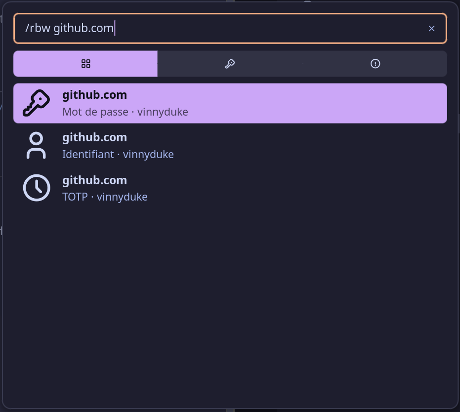
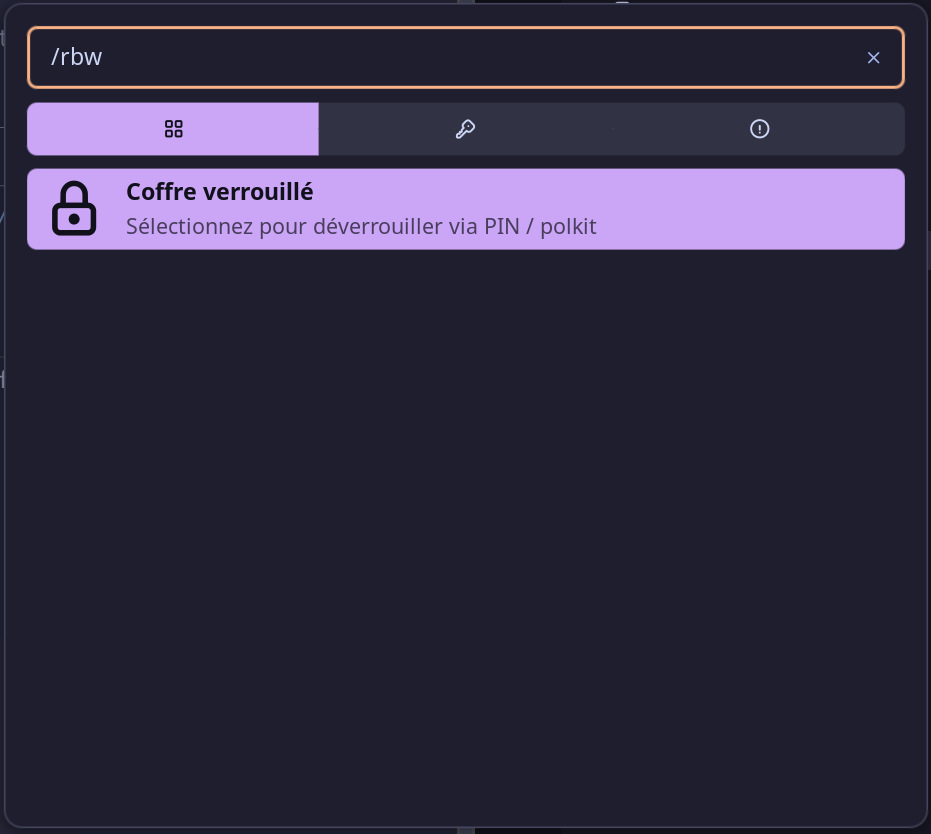

# Bitwarden Launcher Provider

Search your Bitwarden vault and copy credentials on the fly — powered by [`rbw`](https://github.com/doy/rbw).

## Prerequisites

- [rbw](https://github.com/doy/rbw) — the Bitwarden CLI written in Rust.
- A configured Bitwarden account (`rbw config` + `rbw login`).

## Usage

Type `/rbw` in the Noctalia launcher followed by a search term:

| Input | Action |
|-------|--------|
| `/rbw github` | Search vault entries matching "github" |
| `/rbw github octocat` | Search "github", filter results whose username contains "octocat" |

Each matching entry shows up to three results:

- **Password** (key glyph) — copies the password to clipboard
- **Username** (person glyph) — copies the username to clipboard
- **TOTP** (clock glyph) — copies the current TOTP code to clipboard

Only entries of type `Login` are shown. Cards, identities, and notes are filtered out.

## Vault Lock

If your vault is locked, a "Vault locked" prompt appears. Selecting it triggers the `rbw` authentication flow (pinentry / polkit). After a successful unlock, the search runs automatically.

## Features

- Multi-word queries: first word searches, remaining words filter by username
- i18n: English and French translations
- Fire-and-forget vault sync on first query (retries on failure)
- Stale async guards prevent out-of-order results

## Configuration

| Setting | Default | Description |
|---------|---------|-------------|
| Prefix | `/rbw` | Launcher prefix that activates the provider |

No additional configuration required.

## Translation

Add or edit files in `translations/`. The plugin uses `noctalia.tr()` with keys from the active locale's JSON file. Supported:
- `translations/en.json`
- `translations/fr.json`

## License

MIT
